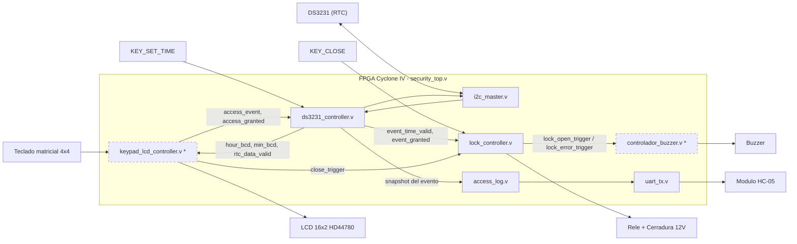
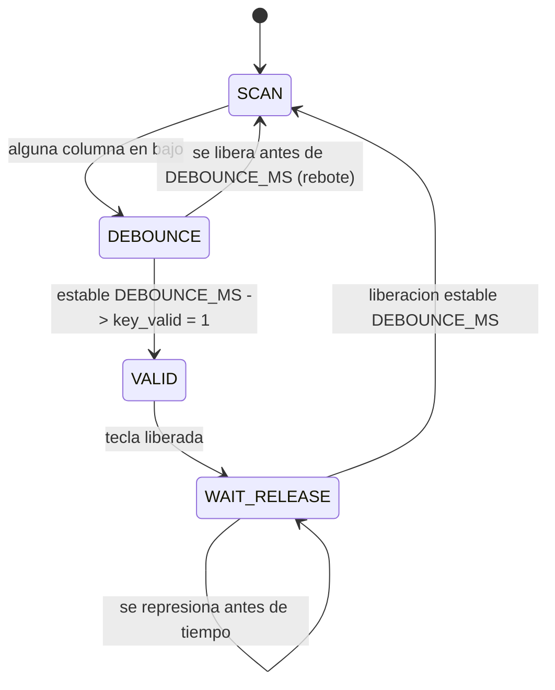
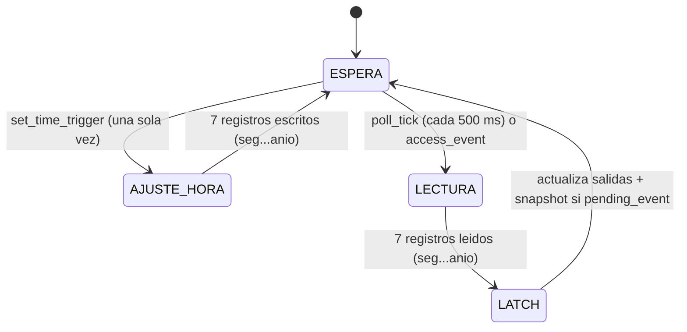
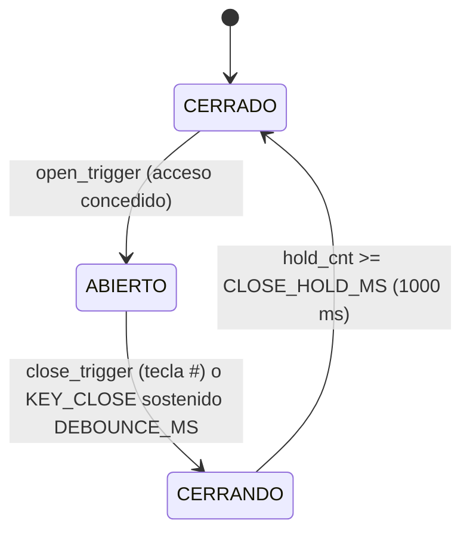
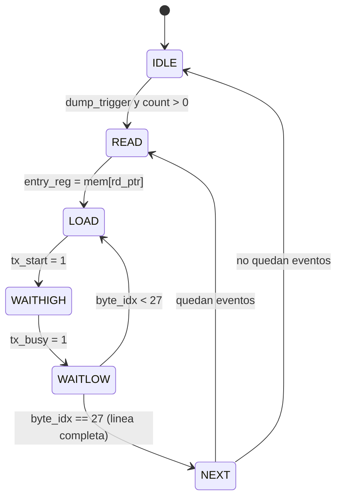

# Informe Final: Sistema de Control de Acceso con RFID sobre FPGA

## Índice

1. [Introducción](https://www.google.com/search?q=%231-introducci%C3%B3n)
2. [Impacto de la solución](https://www.google.com/search?q=%232-impacto-de-la-soluci%C3%B3n)
3. [Cumplimiento de los objetivos](https://www.google.com/search?q=%233-cumplimiento-de-los-objetivos)
4. [Arquitectura implementada](https://www.google.com/search?q=%234-arquitectura-implementada)
5. [Funcionamiento y pruebas](https://www.google.com/search?q=%235-funcionamiento-y-pruebas)
6. [Presentación física del proyecto](https://www.google.com/search?q=%236-presentaci%C3%B3n-f%C3%ADsica-del-proyecto)
7. [Reporte de uso de IA](https://www.google.com/search?q=%238-reporte-de-uso-de-ia)
8. [Conclusiones](https://www.google.com/search?q=%239-conclusiones)
9.  [Bibliografía](https://www.google.com/search?q=%2310-bibliograf%C3%ADa)

---

## 1. Introducción

El presente informe detalla el diseño e implementación de un sistema de control de acceso mediante tecnología RFID, desarrollado sobre la tarjeta de desarrollo FPGA Cyclone IV. El núcleo del sistema integra un lector RFID RC522, un módulo de reloj en tiempo real (RTC) DS3231, una pantalla LCD 16x2 y una cerradura eléctrica de 12V. La organización del hardware se realiza mediante una Máquina de Estados Finita (FSM) principal y submódulos de comunicación (SPI, I2C, UART y bus paralelo) descritos en Verilog. Este diseño parte de una base funcional previa de control de acceso por teclado matricial.

---

## 2. Impacto de la solución

La implementación de este sistema en hardware dedicado (FPGA) garantiza tiempos de respuesta deterministas y un alto nivel de seguridad, eliminando las vulnerabilidades de los sistemas basados en software convencional (Sistemas Operativos). Además, la inclusión de un registro histórico en memoria no volátil exportable vía UART añade un control de auditoría riguroso, fundamental para entornos institucionales o corporativos que requieren trazabilidad de accesos.

---

## 3. Objetivos

**Objetivo general:**

 Implementar en lógica digital síncrona un sistema de control de acceso funcional que autentique usuarios, registre cada evento con fecha/hora exacta, accione una cerradura eléctrica real y transmita un histórico de accesos a un dispositivo externo por Bluetooth.
 
**Objetivos específicos cubiertos por la implementación final:**
- Escanear un teclado matricial 4×4 con antirrebote confiable en ambos flancos (presión y liberación).
- Verificar una contraseña de 4 dígitos y discriminar acceso concedido/denegado.
- Mantener hora y fecha exactas mediante un RTC DS3231 sobre I2C, con mecanismo de configuración inicial de un solo uso.
- Mostrar en una pantalla LCD 16×2 la hora corriente y el resultado de cada intento de acceso.
- Accionar una cerradura eléctrica de 12 V mediante relé, con pausa de seguridad tras el cierre.
- Registrar cada evento (otorgado, denegado, cerrado) en una bitácora circular de 64 entradas y transmitirla periódicamente por Bluetooth (HC-05, 9600 baudios) a una app receptora.
---

## 4. Arquitectura implementada

### 4.1 Visión general del diseño
 
La arquitectura final es un diseño **modular y distribuido**: en vez de una única FSM central de 14 estados como la propuesta originalmente, el sistema entregado reparte el control en **seis FSMs independientes**, una por módulo, coordinadas mediante señales de pulso de un ciclo y protocolos de tipo *comando/listo* (`start`/`busy`/`done`).
 
| FSM | Módulo | Responsabilidad |
|---|---|---|
| Maestro I2C | `i2c_master.v` | Generar START/STOP/bytes en el bus I2C bajo demanda |
| Transmisor UART | `uart_tx.v` | Serializar un byte 8N1 a 9600 baudios |
| Orquestador RTC | `ds3231_controller.v` | Sondeo periódico + snapshot de evento + ajuste de hora |
| Antirrebote de teclado | `keypad_scanner.v` | Escaneo de matriz 4×4 y filtrado de rebotes |
| Controlador LCD | `lcd_hd44780.v` | Inicialización y escritura de caracteres en el HD44780 |
| Cerradura | `lock_controller.v` | Apertura/cierre del relé con pausa de seguridad |
| Validación de bitácora | `access_log.v` | Buffer circular + transmisión de líneas de 28 caracteres |
 
Esta descomposición es, en general, más robusta que una FSM monolítica: cada módulo es sintetizable, simulable y depurable de forma independiente, y el acoplamiento entre ellos se reduce a un puñado de señales por interfaz.
 
Otros dos cambios de alcance quedan documentados por comparación entre el avance y el código final:
 
- El requisito original de registrar **el ID de la tarjeta** en cada evento no tiene equivalente en la versión final: `access_log.v` guarda únicamente fecha/hora y tipo de evento, no una identidad, porque la contraseña compartida por teclado no distingue usuarios individuales.
- El esquema previo de **tres eventos separados** (lectura de tarjeta, acceso otorgado, acceso denegado, con el candado abriendo solo si "lectura de tarjeta Y acceso otorgado" ocurrían juntos) se simplificó a **dos señales** (`kp_access_event` + `kp_access_granted`), consistente con que una contraseña se valida en un único paso, sin una fase de "presencia" independiente de la de "validación".
  
  Código del modulo access_log: [access_log](codigos/acces_log.v)


**Patrones de diseño consistentes en todo el código:**
 
1. **Valor por defecto + sobre-escritura condicional.** Casi todas las señales de pulso (`done`, `tx_start_reg`, `dump_read_en`, `cmd_start`, `rtc_data_valid`, `event_time_valid`) se reinician a `0` al inicio de cada ciclo de reloj y solo se reafirman condicionalmente dentro del `case` de la FSM. Esto evita latches inferidos y garantiza pulsos de exactamente un ciclo. `lock_controller.v` usa la misma técnica para `RELE`: lo asigna en `1` al entrar a `S_OPEN` y luego lo sobre-escribe a `0` condicionalmente más abajo en el mismo bloque — la asignación no bloqueante que ejecuta último en orden de programa es la que prevalece.
2. **Sincronización de entradas asíncronas.** Toda señal externa que entra a un dominio síncrono (columnas del teclado, `KEY_CLOSE`, `KEY_SET_TIME`) pasa por al menos un doble flip-flop antes de usarse en lógica de decisión, mitigando metaestabilidad.
3. **Antirrebote en milisegundos, no en ciclos fijos.** `keypad_scanner.v` y `lock_controller.v` basan su antirrebote en un contador de ticks de 1 ms derivado de `CLK_FREQ_HZ`, de modo que el tiempo de rebote (ms) es independiente de la frecuencia de reloj usada.
4. **Interfaces de tipo comando/confirmación.** `i2c_master`, `uart_tx` y `lcd_hd44780.v` exponen el mismo contrato: el módulo superior activa una entrada de un ciclo (`cmd_*`, `tx_start`, `wr_cmd`/`wr_data`) y espera un pulso `done` o una bandera `busy` antes de emitir la siguiente orden.
### 4.2 Diagrama de bloques
 

`*` Módulo referenciado en `security_top.v` 

Código del módulo:[security top](codigos/security_top.v)
 
### 4.3 Módulos principales

A continuación se describen los módulos que implementan la lógica de control, comunicación y registro de eventos del sistema.

#### 4.3.1 `i2c_master.v` — Maestro I2C genérico
 
Maestro I2C de propósito general controlado por comandos discretos (`cmd_start`, `cmd_stop`, `cmd_write`, `cmd_read`): el módulo superior pide una operación a la vez y espera `done` antes de la siguiente. Encadenar `cmd_start → cmd_write → cmd_start` sin `cmd_stop` intermedio genera automáticamente un **repeated START**, tal como lo exige el DS3231 para pasar de escribir el puntero de registro a leerlo.
 
**Parámetros:** `CLK_FREQ_HZ` (50 MHz) · `I2C_FREQ_HZ` (100 kHz, modo estándar).
 
**Temporización.** `DIV = CLK_FREQ_HZ / (I2C_FREQ_HZ × 2) = 250`, un `tick` cada 250 ciclos (5 µs). Cada semiperiodo de SCL consume un `tick`, así que el periodo completo es ≈10 µs → **100.0 kHz exactos**, coincidiendo con el parámetro declarado.
 
| Fase | Estados | Función |
|---|---|---|
| Reposo | `S_IDLE` | Espera un comando |
| START / repeated START | `S_START1`–`S_START3` | SDA↑ con SCL↑, luego SDA↓ con SCL aún en alto |
| Escritura de byte | `S_WBIT_LO/HI`, `S_WACK_LO/HI`, `S_WEND` | Desplaza 8 bits MSB-primero; libera SDA y captura ACK/NACK en `ack_error` |
| Lectura de byte | `S_RBIT_LO/HI`, `S_MACK_LO/HI/END` | Libera SDA para que el esclavo desplace 8 bits; el maestro responde ACK (`read_ack=1`, quedan más bytes) o NACK (`read_ack=0`, último byte) |
| STOP | `S_STOP1`–`S_STOP3` | SDA↓ con SCL↓, sube SCL, luego SDA↑ con SCL en alto |
| Fin de comando | `S_CMD_DONE` | `done=1` un ciclo, `busy=0`, retorno a `S_IDLE` |
 
```verilog
// Condición START: SDA cae mientras SCL está en alto
S_START1: if (tick) begin sda_oe<=1'b1; sda_out<=1'b1; scl<=1'b1; state<=S_START2; end
S_START2: if (tick) begin sda_out<=1'b0; scl<=1'b1; state<=S_START3; end
S_START3: if (tick) begin scl<=1'b0; state<=S_CMD_DONE; end
```
 
`SDA` es verdaderamente bidireccional (`inout`), controlada por `sda_oe`/`sda_out` y liberada a alta impedancia durante ACK/lectura para que el esclavo (o el propio maestro, al confirmar una lectura) la maneje. `SCL` se maneja en push-pull puro — válido porque, como indica el comentario del módulo, el DS3231 no hace *clock-stretching* en lectura normal.
 
Código del módulo:[i2c master](codigos/i2c_master.v)

#### 4.3.2 `uart_tx.v` — Transmisor UART 8N1
 
Transmisor asíncrono simple: 8 bits de datos, sin paridad, 1 bit de stop (8N1), parametrizado en `CLK_FREQ_HZ` y `BAUD_RATE` (9600 por defecto, el valor de fábrica del HC-05).
 
`BIT_PERIOD = CLK_FREQ_HZ / BAUD_RATE = 50 000 000 / 9600 = 5208` ciclos (división entera). Esto entrega un baudrate real de 50 000 000 / 5208 ≈ 9600.6 baudios — un error de ≈0.006 %, muy por debajo de la tolerancia típica de un UART (~2 %), por lo que no hace falta un generador de baudrate fraccionario.
 
FSM de 4 estados: `S_IDLE` (línea en reposo alto, espera `tx_start`) → `S_START` (baja la línea un `BIT_PERIOD`) → `S_DATA` (desplaza `shift_reg[0]`, LSB primero, 8 veces) → `S_STOP` (sube la línea, libera `tx_busy`) → `S_IDLE`. El contrato de uso es explícito en el propio módulo: no debe pulsarse `tx_start` mientras `tx_busy = 1`. `access_log.v` es el único consumidor.
 
 Código del módulo: [uart](codigos/uart_tx.v)
 
#### 4.3.3 `keypad_scanner.v` — Escaneo de teclado matricial
 
Escaneo de una matriz 4×4 activa en bajo (filas manejadas por la FPGA, columnas con pull-up), con doble sincronización de columnas (`cols_ff0`, `cols_ff1`) y una base de tiempo de 1 ms derivada de `CLK_FREQ_HZ`.
 
| | COL0 | COL1 | COL2 | COL3 |
|---|---|---|---|---|
| **ROW0** | 1 | 2 | 3 | A |
| **ROW1** | 4 | 5 | 6 | B |
| **ROW2** | 7 | 8 | 9 | C |
| **ROW3** | `*` (código E) | 0 | `#` (código F) | D |
 
**Parámetro:** `DEBOUNCE_MS = 20` (por defecto en el módulo; el valor efectivamente instanciado depende de `keypad_lcd_controller.v`, no incluido).
 

 
`SCAN` recorre las 4 filas una a la vez; al detectar una columna en bajo, congela la fila activa y pasa a `DEBOUNCE` sin seguir escaneando, hasta confirmar `key_valid` (un único pulso de un ciclo) y esperar la liberación, también antirrebotada. Esto garantiza **exactamente un `key_valid` por pulsación física**, sin importar cuánto tiempo se mantenga presionada la tecla.

Código del módulo: [keypad scanner](codigos/keypad_scanner.v)
 
#### 4.3.4 `lcd_hd44780.v` — Controlador HD44780
 
Controlador HD44780 en **modo 8 bits, solo escritura** (`LCD_RW` fijo en 0), basado en el patrón `SETUP → PULSE → HOLD` por cada byte transferido:
 
| Constante | Valor | Motivo |
|---|---|---|
| `POWERON_CYCLES` | 20 ms | Espera de estabilización tras encendido/reset, antes del primer comando |
| `SETUP_CYCLES` | 16 ciclos | Margen de *setup* de RS/datos antes de subir E |
| `EN_PULSE_CYCLES` | ~1 µs | Ancho del pulso de Enable |
| `CMD_DELAY_CYCLES` | 2 ms | Margen de ejecución tras cada comando/dato (cubre con holgura el ~1.52 ms que requiere `Clear Display`) |
 
Secuencia de inicialización (ROM de 4 bytes, todos con RS=0):
 
```verilog
init_rom[0] = 8'h38; // Function Set: interfaz 8 bits, 2 líneas, fuente 5x8
init_rom[1] = 8'h0C; // Display ON, cursor off, blink off
init_rom[2] = 8'h01; // Clear Display (requiere >=1.52ms de ejecución)
init_rom[3] = 8'h06; // Entry Mode Set: incrementa cursor, sin shift de pantalla
```
 
Tras completar la ROM, el módulo levanta `ready` y pasa a `S_IDLE`, donde atiende `wr_cmd`/`wr_data` bajo demanda con `busy` como bandera de ocupado — el mismo contrato comando/confirmación de `i2c_master` y `uart_tx`.

Código del módulo: [lcd_hd44780](codigos/lcd.v)
 
#### 4.3.5 `ds3231_controller.v` — Orquestador del RTC
 
Módulo Verilog `controlador_RTC`. Envuelve a `i2c_master.v` para (a) refrescar continuamente hora/fecha del DS3231 cada `POLL_PERIOD_MS`, (b) escribir una hora inicial una sola vez, y (c) capturar una **"foto" temporal** exacta del instante de un intento de acceso.
 
**Mapa de registros DS3231 usado (todos BCD):** `0x00` segundos · `0x01` minutos · `0x02` horas · `0x03` día de semana · `0x04` día del mes · `0x05` mes · `0x06` año.
 
**Parámetros relevantes en la instancia de `security_top.v`:** `I2C_FREQ_HZ = 100 000` · `POLL_PERIOD_MS = 500` (el valor por defecto del módulo es 200 ms; el sistema final usa 500 ms).
 


 
**El mecanismo de snapshot es el punto más fino del módulo.** En vez de disparar una transacción I2C urgente exactamente cuando ocurre `access_event` (más latencia y complejidad), el evento se marca (`pending_event`, `pending_granted`) y se resuelve en la **siguiente lectura periódica que complete** — de hecho, `access_event` fuerza esa lectura a arrancar de inmediato en lugar de esperar el próximo `poll_tick`:
 
```verilog
end else if (pending_poll || access_event) begin
    pending_poll <= 1'b0;
    cmd_start    <= 1'b1;
    st           <= ST_START1_W;
end
```
 
Al llegar a `ST_LATCH`, si `pending_event` estaba activo, la misma lectura que actualiza la hora "en vivo" también congela `event_*_bcd`, `event_granted` y pulsa `event_time_valid` — reutilizando una sola transacción I2C para dos propósitos. La consecuencia práctica es que hay un retardo del orden de ~1 ms (duración de una transacción I2C de 7 bytes a 100 kHz) entre la confirmación de la contraseña y la apertura física de la cerradura, ya que `lock_open_trigger = event_time_valid && event_granted` espera este snapshot — imperceptible para el usuario, pero es una decisión de diseño explícita a favor de un timestamp exacto.
 
**Corrección de formato BCD verificada:** `hour_bcd <= {2'b00, r_hour[5:0]}` retiene los bits [5:0] del registro de horas — correcto para modo 24 h del DS3231 (bit 6 = selector 12/24h, descartado; bits [5:4] = decena 0–2; bits [3:0] = unidad). `month_bcd <= {3'b000, r_month[4:0]}` retiene bits [4:0], descartando el bit de siglo (bit 7) del registro de mes. Ambos coinciden con el datasheet del DS3231.
 
**`rtc_comm_error`** no es una bandera *sticky* permanente: se recalcula en cada intento de transacción (`1` si el esclavo NACKeó la dirección o el puntero, `0` si la transacción fue exitosa), por lo que refleja el estado del **último** intento, no un historial acumulado.

Código del módulo: [controllador_RTC ](codigos/controlador_RTC.V)
 
#### 4.3.6 `keypad_lcd_controller.v` — Verificación de contraseña (no incluido)
 
 
Interfaz inferida (parámetros `CLK_FREQ`, `PASSWORD_LEN = 4`):
 
| Señal | Dirección | Descripción inferida |
|---|---|---|
| `kp_rows` / `kp_cols` | salida / entrada | Conexión directa a la matriz física — sugiere que instancia `keypad_scanner.v` internamente |
| `lcd_rs`, `lcd_e`, `lcd_rw`, `lcd_d` | salida | Conexión directa al LCD — sugiere que instancia `lcd_hd44780.v` internamente |
| `hour_bcd`, `min_bcd`, `rtc_data_valid` | entrada | Para mostrar la hora corriente en reposo |
| `access_event` | salida | Pulso: se completó un intento de contraseña |
| `access_granted` | salida | Válida junto con `access_event`: resultado del intento |
| `close_trigger` | salida | Pulso al presionar `#`, solicitando cerrar la cerradura |
 
Es razonable inferir que internamente combina `keypad_scanner.v` (captura de dígitos) y `lcd_hd44780.v` (mensajes "ACCESO CONCEDIDO"/"ACCESO DENEGADO" y hora en reposo, heredando la idea de la Fig. 2 del avance) con una FSM propia de acumulación de 4 dígitos y comparación de contraseña. **No es posible confirmar, sin el código fuente, cómo se almacena o compara la contraseña** — este punto se retoma como recomendación de seguridad en [§6.3](#63-lecciones-aprendidas-y-trabajo-futuro).


 Código del módulo: [keypad_lcd_controller](codigos/keypad_lcd_controller.v)
#### 4.3.7 `lock_controller.v` — Control de la cerradura
 
Replica en Verilog la lógica de apertura/cierre, con la convención de polaridad documentada explícitamente en el código como **confirmada sobre hardware real**: `RELE = 0` → cerradura cerrada (relé desactivado) · `RELE = 1` → cerradura abierta (relé activado, pasan los 12 V). Esta convención es consistente con una cerradura *fail-secure* cableada al contacto **normalmente abierto (NO)** del relé con las resistencias de pull-up de la FPGA activas: sin energizar el relé, el contacto NO permanece abierto y la cerradura no recibe los 12 V (permanece cerrada por defecto, incluso ante un corte de energía en la lógica de control).
 

 
**Parámetros (instanciados en `security_top.v` con los mismos valores por defecto del módulo):** `DEBOUNCE_MS = 50` · `CLOSE_HOLD_MS = 1000`.
 
Dos caminos independientes llevan de `S_OPEN` a `S_CLOSING`: el pulso `close_trigger` (tecla `#`, ya antirrebotado aguas arriba por `keypad_lcd_controller.v`) y el botón físico `KEY_CLOSE`, sincronizado y antirrebotado *dentro de este mismo módulo* mediante un contador de nivel sostenido (no un antirrebote de ambos flancos como en `keypad_scanner.v`: aquí solo se confirma la pulsación, no la liberación). El estado `S_CLOSING` impone una **pausa de seguridad de 1000 ms** antes de aceptar un nuevo `open_trigger`, evitando reaperturas inmediatas. `door_open` es una salida puramente combinacional (`state == S_OPEN || state == S_CLOSING`), útil para LEDs de estado sin añadir un ciclo de latencia.
 
 Código del módulo: [lock_controller](codigos/lock_controller.v)

#### 4.3.8 `controlador_buzzer.v` — Retroalimentación sonora (no incluido)
 
> [!WARNING]
> El código fuente de este módulo **no fue incluido**. Lo descrito aquí se infiere de su instanciación (`u_buzzer`) en `security_top.v`.
 
Interfaz inferida:
 
| Señal | Dirección | Origen / uso |
|---|---|---|
| `trigger_abrir` | entrada | = `lock_open_trigger` (acceso **concedido**) |
| `trigger_cerrar` | entrada | = `lock_error_trigger` (acceso **denegado**) |
| `buzzer_out` | salida | Pin físico `BUZZER` |
 
Nótese que, pese a los nombres de los puertos (`abrir`/`cerrar`), las señales que los alimentan no representan literalmente "abrir" y "cerrar" la cerradura, sino **concedido** y **denegado** respectivamente — es decir, `controlador_buzzer.v` casi con certeza genera dos patrones de tono distintos (éxito/error) más que acciones mecánicas. Sin el archivo fuente no puede confirmarse la forma exacta de cada patrón (duración, frecuencia, número de beeps).
 

 Código del módulo:[controlador_buzzer](codigos/controlador_buzer.v)


#### 4.3.9 `access_log.v` — Bitácora circular
 
Buffer circular de `DEPTH = 64` entradas de 56 bits cada una (hora/min/seg/día/mes/año en BCD de 8 bits + 2 bits de tipo de evento), con transmisión UART de líneas ASCII de formato fijo.
 
**Formato de línea (28 caracteres, verificado por conteo):**
```
HH:MM:SS DD/MM/YY OTORGADO\r\n   (26 + \r\n = 28)
HH:MM:SS DD/MM/YY DENEGADO\r\n
HH:MM:SS DD/MM/YY CERRADO \r\n   (nótese el espacio de relleno tras "CERRADO")
```
Las tres cadenas de estado (`OTORGADO`, `DENEGADO`, `CERRADO `) miden exactamente 8 caracteres, lo que permite construir la línea completa por concatenación fija de ancho constante — sin necesidad de lógica de padding en tiempo de ejecución.
 
```verilog
function [7:0] bcd_hi_ascii(input [7:0] bcd); bcd_hi_ascii = {4'h3, bcd[7:4]}; endfunction
function [7:0] bcd_lo_ascii(input [7:0] bcd); bcd_lo_ascii = {4'h3, bcd[3:0]}; endfunction
```
Truco estándar de conversión BCD→ASCII: cada nibble de un byte BCD (0–9) es también su dígito ASCII menos `0x30`, así que anteponer el nibble alto `0x3` mapea directamente a `'0'`–`'9'`.
 

 
**Arbitraje escritura/lectura simultánea (verificado caso por caso):** la escritura de un nuevo evento (`event_time_valid`) y el consumo de una entrada por el volcado (`dump_read_en`) pueden coincidir en el mismo ciclo. El `case ({event_time_valid, dump_read_en})` cubre las 4 combinaciones correctamente, incluso bajo buffer lleno:
 
```verilog
case ({event_time_valid, dump_read_en})
    2'b10: if (count == DEPTH) rd_ptr <= rd_ptr + 1'b1;   // lleno: descarta el más antiguo
           else                count  <= count + 1'b1;     // con espacio: solo crece
    2'b01: begin rd_ptr <= rd_ptr + 1'b1; count <= count - 1'b1; end  // solo lectura
    2'b11: rd_ptr <= rd_ptr + 1'b1;                          // uno entra, uno sale: count no cambia
    default: ;
endcase
```
Cuando `count == DEPTH` y ocurre `2'b11`, la escritura sobreescribe exactamente la entrada que se está leyendo ese mismo ciclo (`wr_ptr == rd_ptr` en condición de lleno); como la lectura usa asignación no bloqueante, `entry_reg` captura el valor **anterior** a la escritura — el dato viejo se transmite correctamente antes de perderse.
 
`dump_remaining` se fija como una copia de `count` al aceptar `dump_trigger` (`D_IDLE → D_READ`); eventos que lleguen **durante** un volcado en curso no se incluyen en ese ciclo de transmisión, sino que quedan en el buffer para el siguiente disparo automático (cada `DUMP_PERIOD_S = 5 s`, definido en `security_top.v`).

Código del módulo: [acces_log](codigos/acces_log.v)
 
### 3.12 `security_top.v` — Integración del sistema
 
Módulo top que instancia y conecta todos los anteriores. Puntos de integración relevantes:
 
- **Reset:** `rst_n = KEY_RESET` directo (activo en bajo).
- **Detectores de flanco de bajada** (mismo patrón en dos lugares, comparando `key_sync[2:1] == 2'b10`): `set_time_pulse` desde `KEY_SET_TIME` y `key_close_pulse` desde `KEY_CLOSE`. Nótese que `KEY_CLOSE` se usa **dos veces con propósitos distintos**: como entrada de nivel a `lock_controller.v` (antirrebote de pulsación sostenida) y, en paralelo, como flanco detectado aquí en `security_top.v` únicamente para generar el evento de bitácora "CERRADO".
- **Multiplexado de eventos hacia la bitácora** (bloque combinacional): tiene prioridad `close_event_pulse` (tecla `#` o botón físico) sobre `event_time_valid` (contraseña). Esto implica dos **rutas distintas de origen del timestamp**: los eventos CERRADO usan el valor "en vivo" continuo de `hour_bcd`/`min_bcd`/etc., mientras que OTORGADO/DENEGADO usan el snapshot `event_*_bcd` capturado específicamente por `ds3231_controller.v` — más preciso porque está anclado al instante exacto de la validación, no al ciclo de refresco genérico.
- **Asimetría de latencia entre concedido y denegado:** `lock_error_trigger = kp_access_event && !kp_access_granted` usa la señal cruda del teclado, **sin esperar** el snapshot del RTC — el tono de error suena de inmediato. En cambio `lock_open_trigger = event_time_valid && event_granted` sí espera el snapshot  (#37-ds3231_controllerv--orquestador-del-rtc) antes de abrir la cerradura y sonar el tono de éxito. Es una diferencia imperceptible en uso normal, pero deliberada: el registro en bitácora de un acceso concedido siempre tiene timestamp exacto antes de mover el actuador físico.
- **LEDs de depuración:** `LED[5] = ~log_dumping`, `LED[4:1] = ~log_count[3:0]`, `LED[0] = ~door_open` — los tres invertidos, consistente con LEDs activos en bajo típicos de placas Cyclone IV. `LED_VERDE = door_open` y `LED_ROJO = (BUZZER && !door_open)`: el LED rojo se enciende solo cuando suena el buzzer **y** la puerta está cerrada, aislando visualmente el caso de error del caso de éxito (que también activa el buzzer, pero con `door_open = 1`).
- **Consistencia de anchos verificada:** `access_log.v` calcula `CNT_W = $clog2(DEPTH+1) = $clog2(65) = 7` para `log_count`; `security_top.v` lo declara como `wire [6:0] log_count` — 7 bits, coincide exactamente.

Código del módulo top: [módulo top](codigos/security_top.v)

---

## 5. Funcionamiento y pruebas

Las pruebas se dividieron en subsistemas antes de la integración total:

1. **Pruebas I2C/UART:** Se validó mediante terminal serial la recepción correcta de tramas con formatos ASCII estructurados. El polling del RTC demostró estabilidad cada 200 ms sin colisionar con eventos de escritura.
2. **Pruebas SPI (Lector RFID):** Se utilizó un osciloscopio para verificar los tiempos de establecimiento y retención (setup/hold time) del Modo 0 de SPI a frecuencias divididas[cite: 1]. Se comprobó la correcta inicialización de los registros del RC522 (CommandReg, ModeReg) para energizar la antena[cite: 1].
3. **Prueba de Potencia:** Se validó la apertura de la cerradura eléctrica accionando el relay de 5V comandado por el optoacoplador desde un pin GPIO de la FPGA[cite: 1].

---

## 6. Presentación física del proyecto

El prototipo final se encuentra ensamblado en un locker de MDF diseñado a medida. El panel frontal dispone el lector RFID, la pantalla LCD, los LEDs indicadores (rojo y verde), la puerta simulada con su cerradura de golpe, el circuito de potencia de 12V y la tarjeta FPGA. En la parte posterior hay un espacio para guardar el contenido del locker.

---

## 8. Reporte de uso de IA

Para la realización de este proyecto, se emplearon herramientas de Inteligencia Artificial (ej. ChatGPT/Claude) de forma acotada y estrictamente como asistencia técnica en las siguientes tareas:

* **Generación de rutinas repetitivas:** Creación de las funciones de conversión de BCD a ASCII en Verilog.
* **Estructuración documental:** Corrección de estilo y formato Markdown para este informe final en el repositorio de GitHub.
* **Aclaración de protocolos:** Consultas teóricas rápidas sobre la máquina de estados interna del chip NXP RC522 para la temporización del bus SPI.

* Se usa IA además para hacer verificación y comentariado de los códigos diseñados en cada módulo.

---

## 9. Conclusiones

* La separación en módulos síncronos independientes (I2C, UART, SPI) controlados por una FSM supervisora garantizó que no hubiese cuellos de botella al leer la tarjeta, consultar el reloj y actualizar la pantalla simultáneamente.
* El manejo correcto de líneas inout en Verilog (como en el pin SDA del I2C) y el entendimiento de los tiempos de setup/hold a nivel de osciloscopio fueron determinantes para estabilizar la comunicación con los periféricos.
* Se cumplió con la meta de migrar de un sistema básico de teclado a un sistema IoT/RFID, agregando trazabilidad mediante memoria circular y transmisión asíncrona (UART), demostrando un dominio sólido de los sistemas digitales en hardware.

---

## 10. Bibliografía

* [1] T. Floyd, *Fundamentos de sistemas digitales*, 9th ed. PEARSON EDUCATION, 2006[cite: 1].
* [2] P. Ashenden, *DIGITAL DESIGN An Embedded Systems Approach Using VERILOG*. MORGAN KAUFMANN PUBLISHERS, 2008[cite: 1].